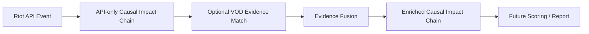

# RiftLab VOD Evidence Fusion Spec

Status: architecture and research only  
Runtime behavior: no production scoring changes  
Related lab: `labs/vod-replay-lab`  
Date: 2026-04-28

## Scope

This specification defines how future RiftLab systems should fuse official Riot API evidence with optional VOD/replay-derived spatial evidence before scoring.

This does not implement computer vision, minimap reading, video upload, pyLoL integration, League Client interaction, scoring changes, or report behavior changes. It is a post-match/offline architecture document only.

## Fusion Philosophy

Riot API is the official source for match facts:

- match identity
- timestamps
- deaths
- kills
- assists
- objectives
- structures
- items
- gold
- CS
- participant and team identity

VOD evidence is optional contextual evidence for interpretation:

- isolation
- objective presence
- rotations
- first move
- zone control
- team spacing
- ward context
- fight setup
- possible wave state
- pressure
- whether a death was costly, useful, neutral, or part of a trade

VOD evidence must never overwrite official Riot API facts. It can only enrich interpretation, confidence, classification, and explanation.

The core rule:

> Riot API says what officially happened. VOD evidence may explain the spatial context around why it mattered.

## Fusion Pipeline

Detailed flow:

1. Riot API event or event cluster is detected.
2. RiftLab creates an API-only Causal Impact Chain.
3. Optional VOD evidence is matched by match, participant, time window, team, objective, region, or structure.
4. Evidence Fusion evaluates agreement, conflict, quality, and relevance.
5. The enriched chain receives a fusion outcome, confidence change, classification change, uncertainties, and explanation text.
6. Future scoring may consume the enriched chain only after validation and product approval.

## Confidence Model

### `apiEvidenceConfidence`

- `high`: direct Riot API facts such as deaths, kills, assists, objective kills, structure kills, participant stats, gold, CS, items, and timestamps.
- `medium`: derived Riot API timing windows such as "death happened 58 seconds before Dragon" or "tower fell 45 seconds after death."
- `low`: uncertain API-only inferred context such as pressure, setup quality, rotation timing, or contest intent.

### `vodEvidenceConfidence`

VOD confidence is based on:

- detection confidence
- source quality
- time alignment confidence
- minimap confidence
- OCR confidence
- participant identity confidence
- signal agreement between multiple VOD-derived signals
- whether signals occur inside the relevant API time window

Suggested signal tiers:

- `>= 0.75`: strong signal
- `0.55-0.74`: usable but confidence-capped
- `< 0.55`: supporting only, not scoring-grade

### `causalConfidence`

Causal confidence starts from the API-only chain and may be upgraded or downgraded by VOD evidence.

Rules:

- It must be capped if VOD quality is low.
- It must decrease or remain unchanged when signals conflict.
- It must never become "certain" from minimap-only evidence.
- It must preserve uncertainty around intent, communication, matchup state, wave state, and subjective decision quality unless directly evidenced.

Example:

- API-only: death before enemy Dragon, causal confidence `medium`.
- VOD: isolated near river, enemy objective presence advantage, enemy zone control.
- Enriched: same negative classification, causal confidence `medium/high`.

## Fusion Outcomes

Possible outcomes:

- `confirm_api_chain`: VOD supports the API-only interpretation without materially changing it.
- `strengthen_api_chain`: VOD increases causal confidence or explanation specificity.
- `weaken_api_chain`: VOD reduces confidence in the API-only interpretation.
- `reclassify_as_trade`: VOD suggests the event was an exchange rather than pure value loss.
- `reclassify_as_positive`: VOD suggests the event enabled clear team value.
- `reclassify_as_neutral`: VOD suggests the event should not be treated as meaningful value loss or gain.
- `reclassify_reason_only`: classification stays the same but the reason changes.
- `insufficient_vod_context`: VOD exists but does not answer the causal question.
- `conflicting_evidence`: VOD signals disagree with each other or with expected chain context.

## Chain-Specific Fusion Rules

### A. Death Before Enemy Objective

API-only:

- classification: negative
- value direction: lost
- causal confidence: medium

VOD upgrades confidence if:

- player was isolated near objective area
- enemy had objective presence advantage
- enemy controlled zone first
- allies were far away
- enemy vision or ward control existed

VOD may weaken the chain if:

- player was opposite side creating pressure
- player drew multiple enemies away
- allied team traded objective elsewhere
- death happened away from objective with no spatial link

Recommended result:

- `strengthen_api_chain` when isolation, enemy presence, and enemy zone control agree.
- `reclassify_as_trade` when cross-map pressure and enemy displacement are clear.
- `insufficient_vod_context` when evidence does not cover the objective window.

### B. Death Before Allied Objective

API-only:

- classification: neutral or small tempo cost
- value direction: neutral or trade
- important note: not objective loss

VOD may reclassify positive or trade if:

- player zoned enemy jungler
- player pulled enemy support or jungle away
- allied team had pit or zone control
- death enabled the secure objective
- player was frontline or sacrifice with team nearby

VOD remains neutral if:

- objective was secured regardless
- no spatial link exists between death and objective

VOD may make it negative only if:

- death nearly prevented objective
- team barely secured objective and lost follow-up due to death
- enemy gained major cross-map return

Recommended result:

- `reclassify_as_trade` or `reclassify_as_positive` only with medium-or-better VOD evidence.
- confidence should remain capped at `medium` unless fight context is very strong.

### C. Death Followed By Structure Loss

API-only:

- classification: timing association
- severity depends on lane relevance, structure value, and death timing

VOD upgrades if:

- player death caused lane or zone collapse
- allies were unable to defend
- enemy wave and players were already pressuring the structure
- player was responsible for that lane or zone

VOD weakens or reclassifies trade if:

- player was creating cross-map pressure
- enemy structure also fell
- player drew enemies away
- structure was already doomed from prior state

Recommended result:

- `strengthen_api_chain` for spatially linked collapse.
- `reclassify_as_trade` when cross-map value is visible.
- `weaken_api_chain` when structure loss appears unrelated.

### D. Objective Loss / Poor Contest

API-only:

- classification: negative objective outcome
- causal confidence: low/medium

VOD reclassifies reason as tempo/setup if:

- enemy arrived first
- enemy controlled river
- allied team entered late or staggered
- player rotated late
- team spacing was poor
- fight setup favored enemy

Recommended result:

- `reclassify_reason_only`: classification stays negative, but reason becomes tempo/setup issue.
- `strengthen_api_chain`: confidence improves when multiple spatial signals agree.

### E. Kill / Teamfight Into Map Gain

API-only:

- kill cluster followed by objective or structure

VOD strengthens if:

- team grouped correctly
- team won zone control before objective
- team converted pressure immediately
- enemy was displaced from objective area

VOD weakens if:

- objective or structure was unrelated
- enemy was cross-map
- map gain came from unrelated side pressure

Recommended result:

- `strengthen_api_chain` for grouped fight into immediate map conversion.
- `weaken_api_chain` when map gain was coincidental or unrelated.

### F. Side Pressure / Trade

API-only can misclassify side pressure because it often sees only death, structure, or objective timing.

VOD can detect:

- player pulling enemies to side lane
- team taking objective elsewhere
- player death as acceptable trade
- enemy losing tempo by chasing

Recommended classification:

- `possible trade`
- `positive trade`
- `neutral pressure`

The exact outcome depends on evidence quality, objective value, structure value, number of enemies displaced, and whether the player's team converted elsewhere.

## Evidence Matching Rules

VOD evidence can be matched to API chains by:

- `matchId`
- `participantId`
- `championName` fallback
- time window overlap
- objective type
- objective time
- structure lane
- team side
- player team
- nearby spatial region

Recommended windows:

- objective setup: 90 seconds before objective
- post-objective: 45 seconds after objective
- structure follow-up: 75 seconds after death or fight
- teamfight cluster: 30 second kill cluster plus 120 second conversion window
- rotation setup: 60-90 seconds before objective

Matching must be conservative. A VOD signal outside the relevant time window should not change classification.

## Quality Gates

Do not use VOD evidence for scoring-grade fusion if:

- time alignment confidence is too low
- participant identity is uncertain
- minimap confidence is too low
- relevant signal confidence is below threshold
- signals conflict heavily
- evidence is outside the relevant time window
- evidence is a manual fixture and the app is not in lab mode

Suggested thresholds:

| Confidence | Use |
| --- | --- |
| `>= 0.75` | Strong signal. Can strengthen causal confidence if matched to API facts. |
| `0.55-0.74` | Usable but capped. Can support explanation and moderate confidence changes. |
| `< 0.55` | Supporting only. Should not drive scoring. |

Manual lab fixtures are never scoring-grade. They can test interpretation shape only.

## Explainability Requirements

Every enriched chain must show:

- API fact
- VOD signal
- how interpretation changed
- confidence change
- what remains uncertain
- whether scoring should change later

Example format:

API confirmed:

> Player died at 11:21 before enemy Dragon at 12:19.

VOD suggested:

> Player was isolated near bot river while Red controlled Dragon entrance.

Fusion result:

> Causal confidence increases from medium to medium/high.

Still uncertain:

> VOD context is needed to confirm wave state, communication, and intent.

Scoring note:

> Future scoring may increase Value Lost confidence only if real VOD evidence validates the isolation and zone control signals.

## Future Type Boundary

The initial type boundary is defined in `lib/vod-evidence/fusion-types.ts`. These types are intentionally not wired into production scoring yet.

Expected future objects:

- `EvidenceFusionInput`
- `EvidenceFusionResult`
- `ApiChainEvidence`
- `VodSignalEvidence`
- `FusionOutcome`
- `FusionRuleId`
- `ConfidenceChange`
- `ClassificationChange`
- `EnrichedChainPreview`
- `FusionQualityGate`
- `FusionUncertainty`

## Production Rule

Until a validated VOD/replay pipeline exists, production RiftLab reports should continue to say:

- Riot API confirms official facts.
- VOD context is unavailable unless the user explicitly provides validated post-match evidence.
- Spatial interpretation is not used in scoring.

