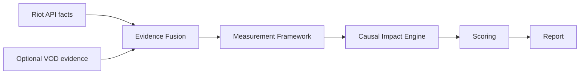

# RiftLab VOD Evidence v0.1

Status: architecture layer only  
Runtime behavior: no current app behavior changes  
Related research: `docs/vod-replay-research-pylol.md`

## Purpose

VOD Evidence v0.1 defines a future evidence format for optional VOD/replay-derived context. It does not implement VOD analysis, computer vision, video upload, model inference, replay extraction, or pyLoL integration.

The current RiftLab report remains API-first. Riot Account-V1 and Match-V5 continue to provide the official match identity, match detail, timeline events, deaths, objectives, structures, participant stats, and frame data.

VOD evidence is intended to enrich future causal chains, not replace Riot API facts.

## Future Data Flow



## What This Adds

- TypeScript types in `lib/vod-evidence/types.ts`.
- Placeholder bridge types in `lib/vod-evidence/bridge.ts`.
- Lightweight validation in `lib/vod-evidence/validation.ts`.
- A small sample fixture at `fixtures/vod-evidence/sample-vod-evidence.json`.

## What This Does Not Add

- No video upload.
- No computer vision.
- No model inference.
- No League Client integration.
- No pyLoL dependency.
- No copied GPL code.
- No changes to current Riot API report behavior.
- No scoring integration yet.

## Evidence Sources

Future VOD evidence can come from different producers as long as they emit the same neutral schema:

- pyLoL-like research tools.
- Manual annotation.
- Custom computer vision services.
- Future model inference pipelines.
- Third-party review tools.

RiftLab should treat all of these as untrusted external evidence until validated.

## Confidence Rules

Every VOD-derived signal must include confidence. This is required because video evidence can be affected by:

- VOD compression.
- Cropped or resized minimaps.
- Spectator overlays.
- Champion icon occlusion.
- Patch/version asset changes.
- OCR drift.
- Time alignment drift.

Report language should distinguish:

- "Riot API confirms"
- "VOD evidence suggests"
- "Low-confidence visual signal"
- "VOD context unavailable"

## Validator Contract

`validateVodEvidenceBundle(bundle)` checks the architecture-level shape and basic integrity of an external evidence bundle.

It validates:

- `schemaVersion` equals `vod-evidence.v0.1`.
- Required root objects and arrays exist.
- Confidence values are finite numbers between 0 and 1.
- Timestamps and time windows are non-negative.
- Participant references point to known participant IDs when participants are available.

It returns:

```ts
{
  isValid: boolean;
  errors: string[];
  warnings: string[];
}
```

This validator is intentionally lightweight. Future versions should add schema validation, coordinate bounds, enum checks, source trust policy, and stricter time-alignment checks before accepting user-uploaded evidence.

## Bridge Types

The placeholder bridge types are intentionally not connected to scoring yet:

- `ApiEvidence`
- `VodEvidence`
- `EvidenceFusionInput`
- `EvidenceFusionResult`

They describe the future boundary where official Riot API facts and optional VOD evidence can be fused into normalized measurements.

## Future Integration Principle

VOD evidence should enrich causal impact chains by adding context that Riot API cannot reliably provide:

- Champion movement tracks.
- Objective presence.
- Team spacing.
- Rotations.
- Ward context.
- Zone control.
- Fight setup.
- Wave state, if validated.

The first production use should be narrow: objective windows and major fights only. Full-game spatial analysis can come later.
