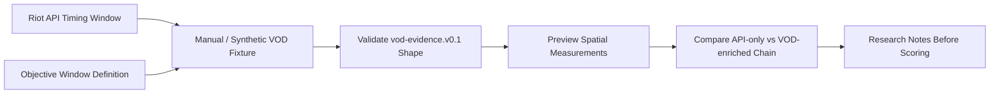

# RiftLab VOD / Replay Lab Plan

Status: research and lab structure only  
Related research: `docs/vod-replay-research-pylol.md`  
Related schema: `docs/vod-evidence-v0.1.md`  
Date: 2026-04-28

## Scope And Guardrails

This plan defines how RiftLab can test pyLoL-inspired VOD/replay ideas without copying pyLoL code, adding pyLoL as a dependency, or changing current production behavior.

This lab must remain post-match and offline. It must not interact with the League Client, read game memory, automate inputs, create live-game overlays, bypass anti-cheat systems, or make live-game claims.

No GPL code is copied into RiftLab. pyLoL is treated as technical inspiration and research material only. If RiftLab ever considers direct pyLoL integration, the licensing path must be reviewed separately first.

## A. Research Goal

The goal is to determine whether optional VOD/replay spatial evidence can improve RiftLab's value attribution for:

- deaths
- objectives
- structures
- rotations
- pressure
- teamfights
- vision

Riot Match-V5 can detect event timing and participant stats. It can tell RiftLab that a death happened before Dragon, that a turret fell after a death, or that an objective was secured after a fight. It cannot reliably explain whether the death was isolated, whether the player was contesting, whether allies were close enough to help, whether the team controlled river first, or whether a death was part of a good map trade.

The lab should test whether spatial evidence can upgrade API-only timing associations into clearer, confidence-aware causal explanations.

## B. Minimum Useful Evidence

The smallest evidence set that would materially improve RiftLab is:

- champion position samples every 1-2 seconds
- objective area presence 90 seconds before and 45 seconds after objectives
- team spacing before fights and objective contests
- isolated player detection before deaths
- ward samples around objective zones
- basic rotation paths between lanes, river, jungle entrances, and objectives
- zone control around Dragon, Baron, Herald, and Voidgrubs

This minimum set is intentionally narrower than full-game VOD understanding. RiftLab does not need perfect video analysis to improve reports. It needs enough spatial evidence to answer, "what context made this event valuable or costly?"

## C. First Validation Target

The first useful experiment should focus on one objective window, not a full match.

Target window:

- 90 seconds before objective
- 45 seconds after objective
- champion positions
- team presence
- isolation
- zone control

Example API-only chain:

> Player death at 11:21 preceded enemy Dragon at 12:19.

VOD evidence should answer:

- Was the player near the objective?
- Was the player alone?
- Were allies nearby?
- Did the enemy team control river first?
- Was the player moving toward the objective or away from it?
- Did this look like a failed contest, side pressure, or isolated death?

This window is useful because it directly tests RiftLab's core product promise: not only what happened, but what the event made possible.

## D. pyLoL-Inspired Feature Map

The following ideas are inspired by pyLoL's direction, but should be implemented independently if RiftLab pursues them.

| pyLoL-inspired concept | Future RiftLab feature | Why it matters |
| --- | --- | --- |
| Champion tracking | Objective presence, rotations, isolation, movement heatmaps | Converts event timing into spatial context. |
| Ward tracking | Vision context, visible/unknown enemy movement, objective setup quality | Helps distinguish avoidable deaths from low-information situations. |
| OCR | Time alignment, scoreboard validation, game clock sync | Keeps VOD timestamps aligned with Riot API timeline. |
| Data Dragon assets | Champion icon templates, detector training data, visual labels | Supports patch-aware recognition datasets without storing assets locally. |
| Path visualization | Post-match movement review and rotation explanation | Helps players see late rotations, first move, and disconnected movement. |
| Region analysis | Zone control and map occupation around river/jungle/objectives | Supports pressure, setup, and objective access claims. |

## E. Risk Boundaries

The lab should keep these boundaries explicit:

- no GPL code copied
- no pyLoL production dependency
- no League Client automation inside RiftLab
- no live-game analysis
- no anti-cheat interaction
- no claims without confidence
- no scoring integration until evidence quality is validated
- no production upload or model inference until there is a separate service design

All VOD-derived language should remain calibrated:

- "Riot API confirms" for official match facts
- "VOD evidence suggests" for visual signals
- "low-confidence visual signal" when detection is uncertain
- "VOD context unavailable" when no evidence is present

## F. Proposed Experiment Phases

### Phase 0: Manual JSON Evidence Fixture

Create hand-authored evidence for one objective window. Use it to test the shape of spatial reasoning without computer vision.

Output: a small JSON fixture that can be validated and discussed.

### Phase 1: Synthetic Minimap Coordinate Fixture

Create synthetic champion positions on normalized Summoner's Rift coordinates. Use fixed examples to test objective presence, isolation, rotation, and zone control calculations.

Output: deterministic lab fixtures with expected interpretation.

### Phase 2: External Script Prototype

In a separate lab or sandbox, prototype reading a short video clip or image sequence and detecting minimap elements. Keep this outside the production app.

Output: experimental JSON only, not production code.

### Phase 3: Champion Icon Detection With Data Dragon Assets

Use Data Dragon assets as source material for detector experiments in a separate lab. Measure recognition confidence, occlusion failure, compression sensitivity, and patch fragility.

Output: detector feasibility notes and confidence measurements.

### Phase 4: Export Neutral `vod-evidence.v0.1` JSON

Any experimental analyzer must emit the neutral evidence format from `docs/vod-evidence-v0.1.md`.

Output: validated evidence bundles with source, model version, time alignment, participants, signals, and quality metadata.

### Phase 5: Preview-Only Enriched Chain View

Build a developer-only view that shows how Riot API chains would be reinterpreted with VOD evidence. Do not change scoring yet.

Output: visual comparison between API-only and API plus VOD explanations.

### Phase 6: Scoring Integration After Validation

Only after manual review shows that VOD evidence improves explanations should scoring consume it. Scoring must remain confidence-aware and conservative.

Output: measured scoring impact behind a feature flag or lab route.

## G. Success Criteria

The lab is working if:

- positions align to match timer well enough for objective windows
- champion identity confidence is acceptable for the tested use case
- objective area presence is stable enough to explain setup/contest windows
- isolation detection matches manual review
- zone control signals are explainable and not just decorative
- output validates against the existing VOD evidence validator
- evidence improves at least one Causal Impact Chain explanation
- report language can clearly separate API facts from visual inference

## H. Failure Criteria

The lab should not continue toward production if:

- minimap detection is too unstable across VOD sources
- time alignment is too unreliable
- champion identity is too noisy for player-specific claims
- processing cost is too high for expected product value
- output cannot improve report confidence or explanation quality
- licensing path blocks production use
- evidence requires unsafe client interaction or live-game access

## How This Helps Scoring Later

The first scoring improvement should not be "more points because video exists." It should be better classification of API-only chains.

Example 1:

API-only: death before enemy Dragon equals medium causal confidence.  
With VOD: player entered river alone, allies were far away, and enemy controlled river first.  
Result: causal confidence can increase, and the death can be framed as isolated objective-window value loss.

Example 2:

API-only: death before allied objective equals neutral or small tempo cost.  
With VOD: player zoned enemy jungler away from the pit and the team secured Dragon.  
Result: the death may become a positive trade or enabling action, not simple value lost.

Example 3:

API-only: death followed by structure loss equals timing association.  
With VOD: player was opposite side generating pressure and the player's team also took a tower.  
Result: the chain may become a map trade instead of one-sided value loss.

## Lab Data Flow

## Recommended Next Experiments

1. Hand-author 3 objective-window fixtures: isolated death, useful death/trade, and late rotation.
2. Define expected interpretations for each fixture before building detection logic.
3. Add a lab-only measurement script that reads fixture positions and computes nearest ally distance, objective presence, and zone control.
4. Compare lab output against manual review notes.
5. Only then test a short video or image sequence outside the production app.

