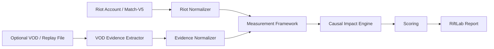

# RiftLab VOD/Replay Research: pyLoL Technical Inspiration

Status: research only  
Source studied: https://github.com/league-of-legends-replay-extractor/pyLoL  
Date: 2026-04-28

## Scope And Guardrails

This document studies pyLoL as technical inspiration for RiftLab's future optional VOD/replay evidence layer.

Do not copy pyLoL code into RiftLab. Do not add pyLoL as a dependency yet. Do not integrate League Client automation, replay extraction, video upload, model inference, or computer vision into the current RiftLab app from this research document.

Licensing note: pyLoL is published under GPL-3.0. Treat it as research material only. If RiftLab ever considers direct integration, redistribution, hosted inference, commercial use, or code reuse, licensing must be reviewed separately before any implementation.

## A. What pyLoL Appears To Do

pyLoL describes itself as a League of Legends replay data extraction program using computer vision. Its README and docs position it as a tool for gathering positional data and analytics from League of Legends videos, including YouTube or locally stored videos.

The repository appears to cover these technical areas:

- Match ID and replay collection: notebooks and modules gather match IDs from Riot API filters, then download `.rofl` replay files through a local League Client workflow.
- Replay playback and minimap capture: a replay scraper runs League replay files, configures replay view state, and captures minimap frames/video from the screen.
- Champion position tracking: the README states that pyLoL can get player locations every second. It also documents a champion tracking model built from minimap frames.
- Ward location extraction: the README states that pyLoL can get ward locations.
- OCR: an OCR preprocessing module extracts real-time KDA/CS-like information from the screen/video.
- Dataset generation: the repo includes dataset collection, preprocessing, CSV/JSON outputs, Riot API enrichment, patch utilities, and self-augmented champion detection dataset ideas.
- Data Dragon usage: the README describes using champion portraits from Riot Data Dragon to build/augment minimap detection datasets.
- Model-based detection: the README references a YOLO-v12 pretrained weight file and an older Roboflow champion tracking option with reported metrics.
- Vision area or map-region analysis: modules calculate pixel/area values over map regions such as jungle and river areas, suggesting early work toward vision/control heatmaps or region-level features.

Observed repository structure:

- `autoLeague/dataset`: Riot API data gathering, replay downloading, dataset generation/preprocessing, CSV/JSON helpers.
- `autoLeague/replays`: replay client/screen capture automation and frame/image processing.
- `autoLeague/preprocess`: OCR workflow.
- `autoLeague/utils`: CSV and patch helpers.
- Root notebooks: staged workflows for getting match IDs, downloading replays, filtering replays, and running the client.
- `assets`: visual examples used in README/docs.
- `docs`: Sphinx/ReadTheDocs documentation, mostly mirroring the README workflow.

## B. pyLoL Ideas Relevant For RiftLab

RiftLab's current pipeline is API-first:

Riot API match detail + timeline -> detected signals -> Causal Impact Engine -> scoring -> report

pyLoL points toward a future optional evidence layer:

Riot API signal + VOD/replay evidence -> Measurement Framework -> Causal Impact Engine -> scoring -> report

The useful conceptual ideas are not the specific implementation details, but the evidence categories:

- Champion tracks from minimap/video can add spatial context missing from Match-V5.
- Ward/object detection can support vision context beyond Riot's aggregate vision score.
- Minimap-derived rotations can connect "what happened" to "what was made possible."
- Objective presence can confirm whether players were actually near dragon, Herald, Baron, or Voidgrubs before a fight.
- Team spacing can separate coordinated pressure from isolated movement.
- Replay/video OCR can recover UI information when API data is missing or when reviewing broadcast/VOD footage.
- Self-augmented datasets from Data Dragon assets suggest a scalable way to bootstrap game-specific detectors without manually labeling every champion portrait.
- Region-level image processing can become a rough proxy for river/jungle vision coverage, zone control, or map occupation.

## C. Mapping To RiftLab's Causal Impact Engine

RiftLab already has causal chains such as death timing -> objective risk, death timing -> structure loss, teamfight -> map gain, and objective -> structure conversion. VOD/replay evidence should not replace Riot API facts. It should raise or lower confidence and explain context.

Potential mappings:

| VOD/replay evidence | Causal Impact Engine use | Example report improvement |
| --- | --- | --- |
| Champion position tracks | Confirm player/team presence near objectives, side lanes, or structure pressure | "You died before dragon" becomes "You died while isolated on top side while your team was setting dragon." |
| Rotation signals | Detect late resets, delayed rotations, first move, collapse timing | "Tempo Sync was weak" becomes "Mid and support arrived 18s after jungle entered river." |
| Objective presence | Verify contest/setup windows before dragon, Herald, Baron, Voidgrubs | Increase confidence for objective setup or objective abandonment chains. |
| Ward positions | Detect whether death/objective loss happened through known/unknown vision | "Avoidable death" can be supported by whether the enemy path was visible. |
| Team spacing | Identify isolated deaths vs grouped trades vs split-pressure patterns | Value Lost can distinguish isolated mistakes from acceptable trades. |
| Zone control | Estimate which team controlled river/jungle entrances before objective spawn | Objective Setup and Vision Control can become evidence-backed rather than inferred from event timing. |
| Fight setup | Detect flank, front-to-back spacing, grouped engage, or staggered arrivals | Teamfight Conversion can explain why the fight was won/lost. |
| Wave state if possible | Identify crash, slow push, side-lane pressure, objective trade setup | Pressure Value can become less speculative. |

## D. Highest-Value Evidence For RiftLab

These are the most valuable future VOD/replay signals for RiftLab because they directly answer "what did your action make possible?"

1. Champion position tracks

   Position samples every 1-2 seconds would allow RiftLab to detect isolation, rotations, objective proximity, split pressure, jungle entry timing, and whether a player could realistically participate in a fight.

2. Ward positions

   Ward detections would make deaths and objective losses much more explainable. A death before objective is a different coaching point if the path was warded, unwarded, swept, or ignored.

3. Minimap movement and rotations

   Rotation timing can explain tempo sync, late arrivals, missed windows, and collapses. This is especially important for mid/jungle/support.

4. Objective presence

   Objective contribution from Riot API alone can be misleading. VOD evidence can show whether a player created access, arrived early, zoned, hovered, or was absent.

5. Team spacing

   Spacing turns generic "teamfight loss" into actionable diagnosis: isolated carry, disconnected frontline, split backline, delayed support, or overextended side-laner.

6. Zone control

   Region occupation around river entrances, jungle quadrants, and objective pits can support pressure and vision claims. This may become a core RiftLab differentiator.

7. Wave state

   This is high value but harder than minimap tracking. If possible, wave state would explain side pressure, reset quality, objective trade validity, and whether deaths were caused by greedy wave collection.

## E. Risky Or Uncertain Areas

1. Replay/client dependency

   pyLoL's workflow appears to depend on local League Client replay files and client/replay automation. RiftLab must remain post-match only and must not interact with live games, game memory, anti-cheat, overlays, input automation, or Vanguard. Future work should prefer user-supplied VOD files or offline replay exports over any live-client integration.

2. Video processing complexity

   Minimap detection requires stable capture dimensions, HUD layouts, color handling, patch-specific icons, occlusion handling, and frame sampling. It is not a small feature.

3. Model accuracy

   Report claims must remain calibrated. Even a high mAP detector can fail in real VODs due to compression, spectator overlays, camera modes, streamer layouts, resizing, minimap skins, colorblind modes, pings, and champion icon occlusion.

4. Patch/version fragility

   Champion icons, minimap assets, ward visuals, map presentation, HUD elements, and Data Dragon versions change. Any VOD analyzer needs patch-aware metadata and confidence degradation.

5. Production scalability

   Video processing is CPU/GPU expensive. A production pipeline needs async jobs, queueing, file storage, rate limits, retry strategy, model versioning, and cost controls.

6. Legal/licensing concerns

   pyLoL is GPL-3.0. Direct code reuse or linking may impose obligations incompatible with future commercial plans. Keep RiftLab's design independent unless legal review approves a specific integration path.

7. Reliability with current League replays/VODs

   It is uncertain how reliably pyLoL works against current patches, non-KR regions, modern replay files, current champion count, different languages, current HUDs, and public VOD formats.

8. Data privacy and upload consent

   VOD upload creates storage, retention, privacy, and moderation obligations. Future RiftLab should make VOD analysis optional and explicit.

## F. Proposed RiftLab Architecture Inspired By pyLoL

The recommended architecture is a clean external evidence pipeline, not in-app CV logic.



### Component responsibilities

1. Riot Normalizer

   Converts Match-V5 detail and timeline into the existing typed RiftLab facts: participants, teams, kills, objectives, structures, frames, item events, and timing windows.

2. VOD Evidence Extractor

   A future offline service that receives a VOD/replay artifact and emits neutral JSON. It should be replaceable: pyLoL-inspired extractor, custom CV service, third-party model, or manual annotation should all produce the same schema.

3. Evidence Normalizer

   Validates external VOD evidence, aligns it to match time, converts coordinates to a stable map coordinate system, attaches confidence, and rejects unsupported/low-confidence evidence.

4. Measurement Framework

   Fuses Riot API facts with VOD evidence. It should not blindly trust CV. It should produce evidence-backed measurements such as:

   - player near objective at T
   - player isolated at T
   - team entered river first
   - side lane pressure before objective
   - ward coverage near objective entrance
   - enemy path visible before death
   - front line/back line spacing unstable

5. Causal Impact Engine

   Uses measurements to upgrade chains from timing association to higher-confidence causal narratives.

6. Scoring

   Scores should include confidence-aware weighting. For example, objective contribution can improve when Riot API objective events and VOD objective presence agree.

7. Report

   The UI should show both API evidence and optional VOD evidence, clearly labelled. It should avoid overclaiming intent.

### Recommended service boundary

Keep VOD/replay analysis outside the Next.js app:

- Next.js remains product/UI and API orchestration.
- Future backend service handles upload, queueing, extraction jobs, model inference, and storage.
- RiftLab consumes only validated evidence JSON.
- Model versions, extractor versions, and confidence must be persisted with the evidence.

## Proposed Neutral JSON Output Format

The schema below is intentionally tool-neutral. It should be possible for pyLoL-inspired research, a future custom model, or a manual labeling tool to emit this format.

```json
{
  "schemaVersion": "vod-evidence.v0.1",
  "source": {
    "type": "vod_file",
    "toolName": "example-analyzer",
    "toolVersion": "0.0.0",
    "modelVersion": "champion-tracker-unknown",
    "inputKind": "video",
    "inputHash": "sha256:example",
    "createdAt": "2026-04-28T00:00:00.000Z"
  },
  "match": {
    "matchId": "LA2_0000000000",
    "gameVersion": "15.8.1",
    "region": "LAS",
    "durationSeconds": 1800,
    "timeAlignment": {
      "method": "manual_or_ocr_or_api_sync",
      "videoStartOffsetMs": 0,
      "confidence": 0.75
    }
  },
  "coordinateSystem": {
    "type": "summoners_rift_normalized",
    "xRange": [0, 1],
    "yRange": [0, 1],
    "origin": "blue_bottom_left",
    "notes": "Coordinates are normalized map positions, not screen pixels."
  },
  "participants": [
    {
      "participantId": 1,
      "teamSide": "Blue",
      "championName": "Aatrox",
      "riotPuuid": null,
      "detectorLabel": "aatrox"
    }
  ],
  "championTracks": [
    {
      "participantId": 1,
      "championName": "Aatrox",
      "samples": [
        {
          "t": 600.0,
          "x": 0.42,
          "y": 0.61,
          "confidence": 0.91,
          "visibility": "visible",
          "sourceFrame": 18000
        }
      ],
      "trackConfidence": 0.86,
      "gaps": [
        {
          "startTime": 720.0,
          "endTime": 728.0,
          "reason": "icon_occluded_by_ping"
        }
      ]
    }
  ],
  "wardSamples": [
    {
      "t": 870.0,
      "teamSide": "Blue",
      "wardType": "control",
      "x": 0.53,
      "y": 0.47,
      "confidence": 0.78,
      "status": "detected"
    }
  ],
  "objectivePresenceSignals": [
    {
      "objectiveType": "Dragon",
      "windowStart": 840.0,
      "windowEnd": 930.0,
      "bluePresentParticipantIds": [2, 3, 4],
      "redPresentParticipantIds": [7, 8],
      "blueArrivalOrder": [3, 2, 4],
      "redArrivalOrder": [8, 7],
      "controllingSide": "Blue",
      "confidence": 0.72
    }
  ],
  "rotationSignals": [
    {
      "id": "rot-001",
      "participantId": 3,
      "startTime": 545.0,
      "endTime": 610.0,
      "fromRegion": "mid_lane",
      "toRegion": "top_river",
      "rotationType": "first_move",
      "arrivedBeforeOpponentSeconds": 12,
      "confidence": 0.7
    }
  ],
  "teamSpacingSignals": [
    {
      "id": "space-001",
      "time": 1120.0,
      "teamSide": "Blue",
      "context": "pre_objective",
      "averageDistance": 0.18,
      "isolatedParticipantIds": [1],
      "clusterParticipantIds": [2, 3, 4, 5],
      "confidence": 0.68
    }
  ],
  "zoneControlSignals": [
    {
      "id": "zone-001",
      "windowStart": 1010.0,
      "windowEnd": 1080.0,
      "region": "baron_river",
      "controllingSide": "Red",
      "blueOccupancySeconds": 18,
      "redOccupancySeconds": 46,
      "wardCoverage": {
        "blue": 0.25,
        "red": 0.62
      },
      "confidence": 0.64
    }
  ],
  "fightSetupSignals": [
    {
      "id": "fight-setup-001",
      "windowStart": 1370.0,
      "windowEnd": 1410.0,
      "fightEventIds": ["riot-event-123"],
      "blueFormation": "split_frontline",
      "redFormation": "grouped_collapse",
      "playerContext": {
        "participantId": 3,
        "state": "late_arrival",
        "distanceFromTeam": 0.22
      },
      "confidence": 0.59
    }
  ],
  "waveStateSignals": [
    {
      "id": "wave-001",
      "time": 900.0,
      "lane": "Bot",
      "state": "slow_push_to_red",
      "confidence": 0.42,
      "notes": "Optional and low confidence until lane/wave detector is validated."
    }
  ],
  "ocrSignals": [
    {
      "time": 600.0,
      "field": "game_clock",
      "value": "10:00",
      "confidence": 0.95
    }
  ],
  "quality": {
    "overallConfidence": 0.7,
    "minimapConfidence": 0.78,
    "ocrConfidence": 0.82,
    "frameSampleRate": 1,
    "unsupportedReasons": [],
    "warnings": [
      "Compressed VOD may reduce champion icon confidence."
    ]
  }
}
```

## Optional TypeScript Interfaces

These interfaces are for future design only. They should not be wired into the app until RiftLab has a real evidence ingestion boundary.

```ts
export type VodEvidenceSchemaVersion = "vod-evidence.v0.1";
export type TeamSide = "Blue" | "Red" | "Unknown";
export type Confidence = number;

export type VodEvidenceBundle = {
  schemaVersion: VodEvidenceSchemaVersion;
  source: VodEvidenceSource;
  match: VodEvidenceMatch;
  coordinateSystem: VodCoordinateSystem;
  participants: VodParticipant[];
  championTracks: ChampionTrack[];
  wardSamples: WardSample[];
  objectivePresenceSignals: ObjectivePresenceSignal[];
  rotationSignals: RotationSignal[];
  teamSpacingSignals: TeamSpacingSignal[];
  zoneControlSignals: ZoneControlSignal[];
  fightSetupSignals: FightSetupSignal[];
  waveStateSignals?: WaveStateSignal[];
  ocrSignals?: OcrSignal[];
  quality: VodEvidenceQuality;
};

export type VodEvidenceSource = {
  type: "vod_file" | "replay_capture" | "manual_annotation" | "third_party";
  toolName: string;
  toolVersion: string;
  modelVersion?: string;
  inputKind: "video" | "image_sequence" | "replay" | "annotation";
  inputHash?: string;
  createdAt: string;
};

export type VodEvidenceMatch = {
  matchId?: string;
  gameVersion?: string;
  region?: string;
  durationSeconds?: number;
  timeAlignment: {
    method: "manual" | "ocr" | "api_sync" | "unknown";
    videoStartOffsetMs: number;
    confidence: Confidence;
  };
};

export type VodCoordinateSystem = {
  type: "summoners_rift_normalized" | "screen_pixels" | "unknown";
  xRange: [number, number];
  yRange: [number, number];
  origin: "blue_bottom_left" | "top_left" | "unknown";
  notes?: string;
};

export type VodParticipant = {
  participantId: number;
  teamSide: TeamSide;
  championName?: string;
  riotPuuid?: string | null;
  detectorLabel?: string;
};

export type PositionSample = {
  t: number;
  x: number;
  y: number;
  confidence: Confidence;
  visibility: "visible" | "occluded" | "inferred" | "unknown";
  sourceFrame?: number;
};

export type ChampionTrack = {
  participantId: number;
  championName?: string;
  samples: PositionSample[];
  trackConfidence: Confidence;
  gaps?: Array<{ startTime: number; endTime: number; reason: string }>;
};

export type WardSample = {
  t: number;
  teamSide: TeamSide;
  wardType: "stealth" | "control" | "farsight" | "unknown";
  x: number;
  y: number;
  confidence: Confidence;
  status: "detected" | "inferred" | "expired";
};

export type ObjectivePresenceSignal = {
  objectiveType: "Dragon" | "Elder" | "Voidgrubs" | "Rift Herald" | "Baron" | "Unknown";
  windowStart: number;
  windowEnd: number;
  bluePresentParticipantIds: number[];
  redPresentParticipantIds: number[];
  blueArrivalOrder?: number[];
  redArrivalOrder?: number[];
  controllingSide: TeamSide;
  confidence: Confidence;
};

export type RotationSignal = {
  id: string;
  participantId: number;
  startTime: number;
  endTime: number;
  fromRegion: string;
  toRegion: string;
  rotationType: "first_move" | "late_rotation" | "collapse" | "reset_return" | "unknown";
  arrivedBeforeOpponentSeconds?: number;
  confidence: Confidence;
};

export type TeamSpacingSignal = {
  id: string;
  time: number;
  teamSide: TeamSide;
  context: "pre_objective" | "teamfight" | "side_lane" | "neutral";
  averageDistance?: number;
  isolatedParticipantIds: number[];
  clusterParticipantIds: number[];
  confidence: Confidence;
};

export type ZoneControlSignal = {
  id: string;
  windowStart: number;
  windowEnd: number;
  region: string;
  controllingSide: TeamSide;
  blueOccupancySeconds?: number;
  redOccupancySeconds?: number;
  wardCoverage?: { blue: number; red: number };
  confidence: Confidence;
};

export type FightSetupSignal = {
  id: string;
  windowStart: number;
  windowEnd: number;
  fightEventIds?: string[];
  blueFormation?: string;
  redFormation?: string;
  playerContext?: {
    participantId: number;
    state: "isolated" | "frontline" | "backline" | "flank" | "late_arrival" | "unknown";
    distanceFromTeam?: number;
  };
  confidence: Confidence;
};

export type WaveStateSignal = {
  id: string;
  time: number;
  lane: "Top" | "Mid" | "Bot";
  state: "pushing_blue" | "pushing_red" | "slow_push_to_blue" | "slow_push_to_red" | "neutral" | "unknown";
  confidence: Confidence;
  notes?: string;
};

export type OcrSignal = {
  time: number;
  field: "game_clock" | "kda" | "cs" | "gold" | "level" | "unknown";
  value: string;
  participantId?: number;
  confidence: Confidence;
};

export type VodEvidenceQuality = {
  overallConfidence: Confidence;
  minimapConfidence?: Confidence;
  ocrConfidence?: Confidence;
  frameSampleRate?: number;
  unsupportedReasons: string[];
  warnings: string[];
};
```

## Measurement Framework Additions

Future RiftLab should convert raw VOD evidence into normalized measurements before scoring.

Candidate measurements:

- `PlayerObjectivePresence`: whether a participant was near an objective during a setup/contest window.
- `FirstMoveWindow`: which side entered river or jungle first.
- `LateRotation`: participant arrived after a fight/objective decision was already made.
- `IsolationAtDeath`: participant distance from nearest allies before death.
- `KnownEnemyPath`: enemy movement was visible through wards or minimap before a death.
- `TeamSpacingBreakdown`: team split into incompatible clusters before fight.
- `ZoneControlByRegion`: side-controlled area by occupancy and ward coverage.
- `ObjectiveSetupQuality`: combined presence, vision, spacing, and arrival timing before objective.
- `TradeValidity`: whether death/objective loss was offset by map gain elsewhere.

Each measurement should include:

- `sourceEvidenceIds`
- `timeWindow`
- `confidence`
- `apiAgreement`: whether Riot API timing supports the VOD signal
- `reportLanguage`: short evidence text that can be shown to the user

## Recommended Next Experiments

1. Define a tiny offline fixture format

   Create a hand-authored VOD evidence JSON file for one known match. Do not build CV yet. Use it to test how RiftLab would fuse API + VOD evidence.

2. Add an internal evidence validator

   Before any UI work, create a schema validator for `VodEvidenceBundle` in isolation. Reject missing match IDs, impossible times, bad participant IDs, and unsupported coordinate systems.

3. Build a manual annotation prototype

   A simple JSON/manual annotation tool can prove whether champion tracks and objective presence actually improve RiftLab's causal reports before investing in computer vision.

4. Run a limited minimap detection spike outside RiftLab

   In a separate sandbox repository, test whether champion icon detection from a VOD can produce useful normalized tracks for 5-10 minutes of footage. Measure confidence gaps, not just visual demos.

5. Test time alignment

   VOD evidence is useless if timestamps drift. Test game clock OCR or manual sync markers against Riot timeline events.

6. Prioritize objective windows first

   Do not try full-game understanding immediately. Start with 90 seconds before/after dragon, Herald, Baron, Voidgrubs, and major teamfights.

7. Keep claims confidence-aware

   Add report language that distinguishes:

   - "Riot API confirms"
   - "VOD evidence suggests"
   - "Low-confidence visual signal"
   - "VOD context unavailable"

8. Review licensing before integration

   If the team wants to use pyLoL directly, review GPL-3.0 obligations and distribution/service architecture first.

## Product Takeaway

pyLoL's most useful lesson for RiftLab is architectural: League analysis becomes more powerful when Riot API events are fused with spatial evidence from video or replay capture. Riot API can say that a player died before dragon. VOD evidence can explain whether that death was isolated, forced by pressure, made visible by missing wards, traded for structure, or caused by late team rotation.

RiftLab should use this direction to build a tool-neutral evidence layer. The key product principle stays the same:

"We do not only measure what you did. We measure what you made possible."

